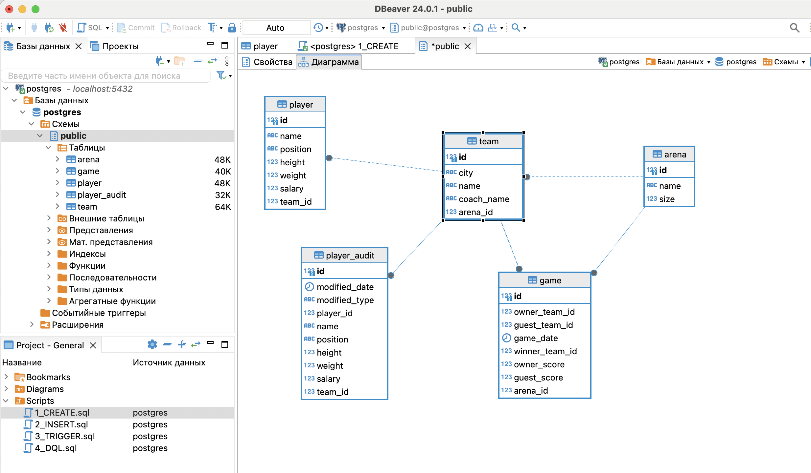

# PostgreSQL_DataBase 

Пример создания базы данных и работы с ней с использованием среды DBeaver и PostgreSQL:
- DDL commands
- DML commands
- DQL commands

## CREATE
Создаем таблицы __arena__, __team__, __player__, __game__. Указываем типы данных, первичные ключи, ограничения и правила удаления. Связываем таблицы по __id__ с помощью внешних ключей. 

- Для столбца id правильнее было бы указать тип данных `SERIAL`, либо указать правило автогенерации `GENERATED ALWAYS AS IDENTITY PRIMARY KEY`. Однако проект учебный и задания далее предполагали самостоятельный ввод id, поэтому от автоматической нумерации пришлось отказаться.

Физическая модель созданной базы данных:



## INSERT

Заполняем таблицы данными

Таблица player связана с таблицей team __(player.team_id = team.id)__. Поэтому для добавления в таблицу player id команды "Барселона", в которой числится игрок Иван Иванов, лучше использовать `вложенный запрос`
```SQL
INSERT INTO player 
VALUES (260, 'Иван Иванов', 'форвард', 200, 100, 250000, (SELECT id FROM team WHERE name = Барселона)) 
```

## TRIGGER

Для отслеживания изменний в таблице player создаем новую таблицу __player_audit__ и триггерную функцию __fnc_trg_player_changed__. Триггер срабатывает строго ПОСЛЕ команд UPDATE, DELETE, INSERT. 

```SQL
CREATE TRIGGER trg_player_changed 
    AFTER INSERT OR UPDATE OR DELETE ON player
    FOR EACH ROW EXECUTE FUNCTION fnc_trg_player_changed();
```

После команды INSERT добавленная новая строка передается в переменную __NEW__, откуда функция берет данные и добавляет в таблицу для аудита.

```SQL
IF TG_OP = 'INSERT' THEN
    INSERT INTO player_audit (modified_date, modified_type, player_id, name, position, height, weight, salary, team_id)
    SELECT now(), TG_OP, NEW.id, NEW.name, NEW.position, NEW.height, NEW.weight, NEW.salary, NEW.team_id;
```

## DQL

Представлены примеры получения информации из таблиц с помощью `Data Query Language` запросов.
Среди использованных методов:
- вложенные запросы
- оператор JOIN
- условный оператор CASE
- групповые функции
- общие табличные выражения (CTE)
